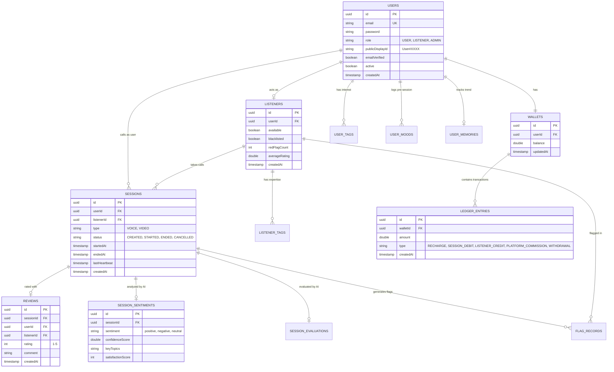
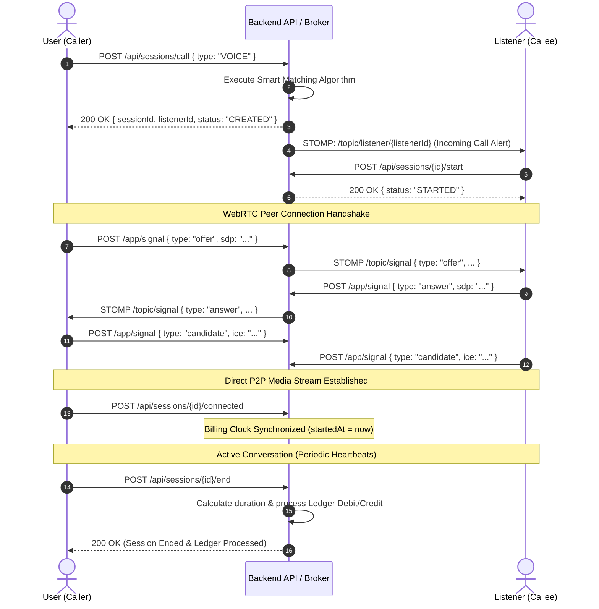

# 📖 EXPRESS Backend — Complete Technical & Architectural Specification

This document provides an exhaustive, deep-dive architectural and technical specification for the **EXPRESS Backend**, built on Java 21 and Spring Boot 3.5.10.

---

## 📑 Table of Contents

1. [Architectural Overview](#1-architectural-overview)
2. [Domain Model & Database Schema (ERD)](#2-domain-model--database-schema-erd)
3. [Session Lifecycle & WebRTC Signaling Flow](#3-session-lifecycle--webrtc-signaling-flow)
4. [Smart AI Matching & Sentiment Pipeline](#4-smart-ai-matching--sentiment-pipeline)
5. [FinTech Engine, Billing Math & Double-Entry Ledger](#5-fintech-engine-billing-math--double-entry-ledger)
6. [Security, Authentication & Authorization](#6-security-authentication--authorization)
7. [Scheduler, Reliability & Edge Case Handling](#7-scheduler-reliability--edge-case-handling)
8. [Cloud Deployment Architecture](#8-cloud-deployment-architecture)

---

## 1. Architectural Overview

The backend is built following Clean Layered Architecture and Domain-Driven Design (DDD) principles:

- **API Layer (`com.express.expressbackend.api`)**: Contains REST controllers and STOMP message mapping controllers. Interacts strictly via DTOs and delegates domain logic to service layers.
- **Config Layer (`com.express.expressbackend.config`)**: Spring Security 6 filter chain, CORS origins configuration, and STOMP WebSocket broker registration.
- **Domain Layer (`com.express.expressbackend.domain`)**: Subdivided into modular domain packages (`ai`, `auth`, `flag`, `ledger`, `listener`, `otp`, `payment`, `review`, `session`, `signaling`, `user`, `wallet`). Each domain contains entities, JPA repositories, DTO requests/responses, and service business logic.

---

## 2. Domain Model & Database Schema (ERD)

The relational schema is backed by PostgreSQL. Primary keys are UUIDs or Auto-Increment IDs depending on entity privacy requirements.



---

## 3. Session Lifecycle & WebRTC Signaling Flow

### Lifecycle State Machine

1. **`CREATED`**: Caller initiates a call. Smart matching algorithm selects an available listener. A WebSocket notification is pushed to the listener's topic.
2. **`STARTED`**: Listener accepts the call. WebRTC signaling begins exchanging SDP and ICE candidates.
3. **`CONNECTED`**: Both browser clients successfully establish peer-to-peer audio/video streaming. Client notifies `/api/sessions/{id}/connected`. **Billing timer strictly begins here.**
4. **`ENDED`**: Either party disconnects or clicks End Call. Billing calculation executes, debiting caller and crediting listener.
5. **`CANCELLED`**: Call rejected by listener or timed out prior to connection.

### WebRTC Connection Sequence



---

## 4. Smart AI Matching & Sentiment Pipeline

### Matching Algorithm Scoring Function

When a user requests a session with tags $\mathcal{T}_{\text{user}}$ and mood $M_{\text{user}}$, the system ranks all available listeners $L$ using the composite scoring function:

$$\text{Score}(L) = S_{\text{tags}} + S_{\text{rating}} + S_{\text{mood}} + S_{\text{experience}} - P_{\text{flags}}$$

#### 1. Tag Overlap Score ($S_{\text{tags}} \in [0, 40]$):
$$S_{\text{tags}} = \left( \frac{|\mathcal{T}_{\text{user}} \cap \mathcal{T}_{L}|}{|\mathcal{T}_{\text{user}}|} \right) \times 40$$

#### 2. Rating Score ($S_{\text{rating}} \in [0, 30]$):
$$S_{\text{rating}} = \left( \frac{\text{Rating}(L) - 1.0}{4.0} \right) \times 30$$

#### 3. Mood Affinity Score ($S_{\text{mood}} \in [0, 20]$):
Calculates semantic affinity with predefined emotional vectors:
- **Stressed**: `stress`, `mental health`, `mindfulness`, `relaxation`
- **Anxious**: `anxiety`, `mental health`, `calm`, `mindfulness`
- **Neutral**: `general`, `motivation`, `life advice`
- **Good**: `motivation`, `career`, `growth`, `goals`

#### 4. Flag Penalty ($P_{\text{flags}}$):
$$P_{\text{flags}} = \text{RedFlagCount}(L) \times 5$$

---

## 5. FinTech Engine, Billing Math & Double-Entry Ledger

### Pricing & Rate Rules
- **Rate**: ₹5.00 per minute (or fractions rounded up).
- **Platform Split**: 70% credited to Listener, 30% retained as Platform Commission.

### Billing Execution Algorithm (`SessionService.endSession`)

$$\text{Total Seconds} = \text{Duration}(\text{startedAt}, \text{endedAt})$$
$$\text{Billed Minutes} = \max\left(1, \left\lceil \frac{\text{Total Seconds}}{60} \right\rceil\right)$$
$$\text{Total Deducted} = \text{Billed Minutes} \times 5.00$$
$$\text{Listener Credit} = \text{Total Deducted} \times 0.70$$
$$\text{Platform Commission} = \text{Total Deducted} \times 0.30$$

### Atomic Ledger Transactions
Every financial event records immutable entries in `ledger_entries`:
1. `RECHARGE`: User wallet credited upon Razorpay HMAC verification.
2. `SESSION_DEBIT`: Caller wallet debited for session time.
3. `LISTENER_CREDIT`: Listener wallet credited.
4. `PLATFORM_COMMISSION`: Platform revenue recorded.
5. `WITHDRAWAL`: Listener requested payout deducted from balance.

---

## 6. Security, Authentication & Authorization

### Filter Chain Order
```
Client Request -> JwtAuthFilter -> SecurityFilterChain -> Controller
```

- **Stateless Session Management**: `SessionCreationPolicy.STATELESS`
- **BCrypt Encryption**: `BCryptPasswordEncoder(10)`
- **Token Claims**: Subject = User Email, Claims = `userId`, `role`, `issuedAt`, `expiration` (24 Hours).

---

## 7. Scheduler, Reliability & Edge Case Handling

### 1. `SessionTimeoutScheduler`
- Runs every 60 seconds.
- Automatically cleans up sessions in `CREATED` status that were not accepted within 45 seconds.
- Detects calls missing client heartbeat for $>90$ seconds, automatically ending them to prevent overcharging.

### 2. Disconnect Protection
If a user closes their browser window abruptly, the WebRTC `oniceconnectionstatechange` handler triggers an immediate graceful `endSession` call. If network drops completely, the backend scheduler auto-closes the session at the last verified heartbeat.

---

## 8. Cloud Deployment Architecture

```
┌────────────────────────────────────────────────────────────┐
│                    Vercel Edge Network                     │
│  - Serves Next.js 16 Web Application                       │
│  - Routes /api/* and /ws/* via HTTPS/WSS to Render Server │
└─────────────────────────────┬──────────────────────────────┘
                              │
                              ▼
┌────────────────────────────────────────────────────────────┐
│                   Render Cloud Web Service                 │
│  - Containerized Spring Boot 3.5 on Java 21 (Docker)       │
│  - Auto-restart and health-check monitoring                │
│  - Environment variables & secrets managed in Vault        │
└─────────────────────────────┬──────────────────────────────┘
                              │
                              ▼
┌────────────────────────────────────────────────────────────┐
│               Render Managed PostgreSQL Cluster            │
│  - PostgreSQL 16 relational storage                        │
│  - Encrypted at rest & daily snapshots                     │
└────────────────────────────────────────────────────────────┘
```
